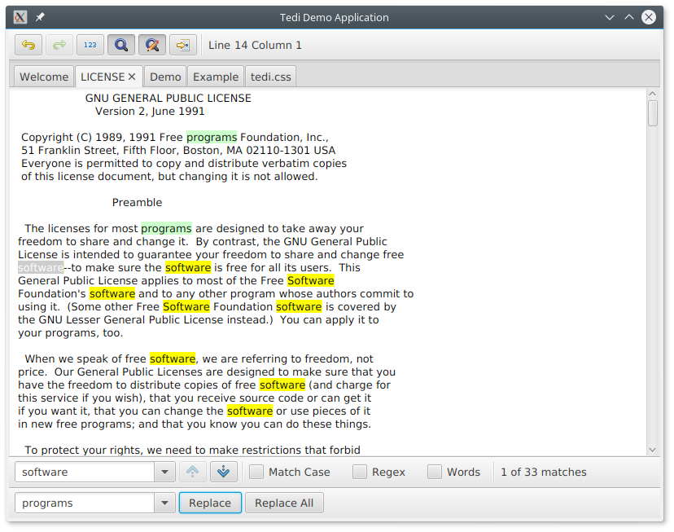

Here's some screenshots from the Demo application :

## Editing Kotlin Source Code
With a simple regex based syntax highlighter.

## Find and Replace

The green highlights are replacements that have been made.
The yellow highlights are matches (that haven't been replaced).

## Two Views

Here we see two TediAreas displaying the same document.
The views are independent
(for example, we can see that they are using different fonts).

## Specialised HighglightRanges

The caret is just after an opening brace (curly bracket).
We've used PairedHighlightRanges, and with the help of the
HighlightMatchedPairs class, when the caret touches one of the pairs,
then both are highlighted.

Note that TediArea itself knows nothing of PairedHighlightRanges, nor
HighlightMatchedPairs. You could create other sub-classes of
HighlightRange, for other effects.

For example, you could create a HighlightRange which has a URL.
Use a blue Highlight (with an underscore), and open the link in a
web browser when it's double clicked.

## Java Example Application

Here we see the Example application. It is simpler than the
demo application above, but is written in Java, therefore it will
be easier to understand for those not familiar with Kotlin.

FYI, Tedi is written in Kotlin, but can be used from within a Java
application without any problems.

